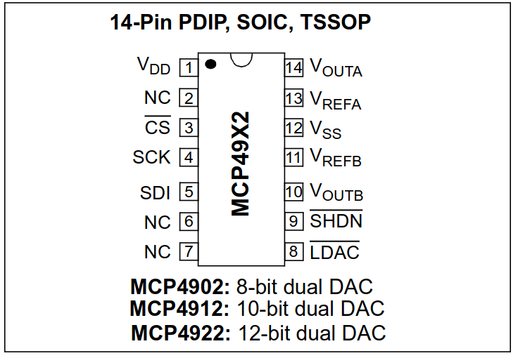
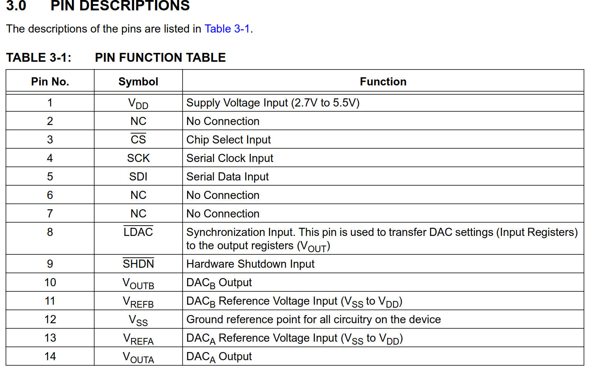
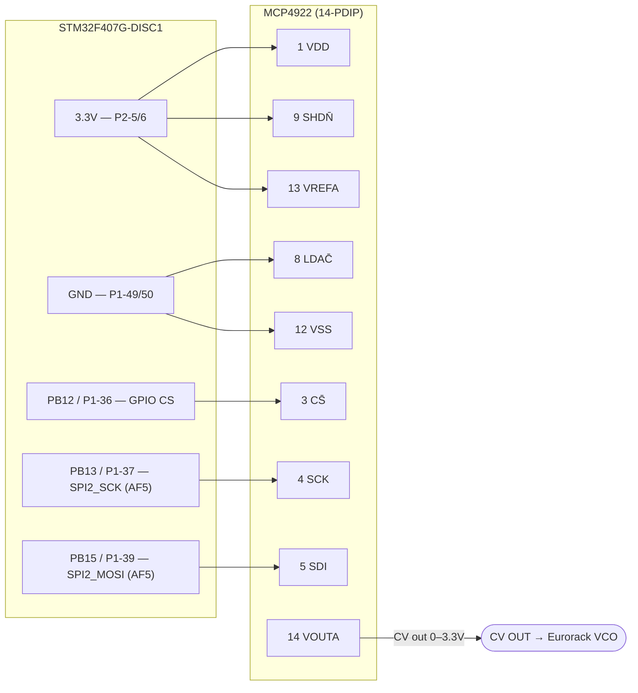

# MCP4922 Wiring — Datasheet-Verified

Complete, datasheet-verified wiring for the MCP4922 dual 12-bit SPI DAC to the
STM32F407G-DISC1, used to generate 1V/oct CV. Every pin number and alternate function
below is taken directly from the manufacturer datasheets listed under
[Sources](#datasheet-sources).

See also: [DAC Output — CV Generation](../firmware/dac-output.md),
[SPI Driver](../firmware/spi-driver.md), [CV Math — 1V/oct](../concepts/cv-math.md),
[Saleae Logic 2 — SPI Decode Setup](./saleae-logic2-spi-setup.md),
[ADR-001 — SPI Peripheral Selection](../decisions/adr-001-spi-peripheral.md).

---

## MCP4922 pinout (14-pin PDIP) — Microchip Table 3-1

```
            ┌──────⌣──────┐
   VDD  1 ──┤●            ├── 14  VOUTA   ← CV OUTPUT (Channel A)
    NC  2 ──┤             ├── 13  VREFA   ← +3.3V (full-scale ref)
   CS̄  3 ──┤             ├── 12  VSS     ← GND
   SCK  4 ──┤  MCP4922    ├── 11  VREFB   (Ch B ref, unused)
   SDI  5 ──┤  12-bit DAC ├── 10  VOUTB   (Ch B out, unused)
    NC  6 ──┤             ├──  9  SHDN̄   ← +3.3V  (hardware enable)
    NC  7 ──┤             ├──  8  LDAC̄   ← GND
            └─────────────┘
```




---

## STM32 side (DISC1 / STM32F407VG)

| STM32 signal | Pin | Header | AF | Role |
|---|---|---|---|---|
| SPI2_NSS (used as plain GPIO CS) | PB12 | **P1-36** | — | software chip-select |
| SPI2_SCK | PB13 | **P1-37** | **AF5** | clock |
| SPI2_MISO | PB14 | P1-38 | AF5 | **unused** (DAC is write-only) |
| SPI2_MOSI | PB15 | **P1-39** | **AF5** | data → SDI |
| 3.3 V rail | — | **P2-5 / P2-6** | — | power + VREF |
| GND | — | **P1-49 / P1-50** | — | ground |

SPI2 is on **APB1** (max 42 MHz), so the ÷8 bring-up clock is well within the MCP4922's
20 MHz limit. PB12–PB15 are not used by any onboard DISC1 peripheral — unlike SPI1's
PA5–PA7, which collide with the LIS3DSH accelerometer (the reason ADR-001 chose SPI2).

---

## Connection table (verified)

| MCP4922 | Symbol | Dir | Connects to | STM32 / header | Notes |
|--:|---|:--:|---|---|---|
| **1** | VDD | PWR | **+3.3 V** | P2-5 / P2-6 | add 0.1 µF decoupling to GND |
| 2 | NC | — | *no connect* | — | |
| **3** | CS̄ | in | GPIO chip-select | **PB12 → P1-36** | software CS, idle **high** |
| **4** | SCK | in | SPI2_SCK | **PB13 → P1-37** | AF5 |
| **5** | SDI | in | SPI2_MOSI | **PB15 → P1-39** | AF5 |
| 6 | NC | — | *no connect* | — | |
| 7 | NC | — | *no connect* | — | |
| **8** | LDAC̄ | in | **GND** | P1-49/50 | tie low → output latches on CS↑ |
| **9** | SHDN̄ | in | **+3.3 V** | P2-5/6 | **must be high or all outputs are disabled** |
| 10 | VOUTB | out | *leave open* | — | Channel B unused |
| 11 | VREFB | in | *NC (or +3.3 V)* | — | tie to VDD only if Ch B is used later |
| **12** | VSS | PWR | **GND** | P1-49/50 | |
| **13** | VREFA | in | **+3.3 V** | P2-5/6 | sets full scale (count 4095 ≈ VREF) |
| **14** | VOUTA | out | **CV OUT** | → scope / Eurorack jack | the CV signal |

!!! warning "Two pins that are easy to miss"
    **SHDN (pin 9)** is an active-low *hardware* shutdown and must be tied high, even
    though the command word also sets the per-channel `/SHDN` bit. If pin 9 floats, the
    bench test reads 0 V. **VOUTA (pin 14)** — not pin 8 — is the CV output to probe.

---

## Wiring diagram



---

## Bench bring-up notes

With VREFA = VDD = 3.3 V and gain = 1× (`GA` bit), full-scale output (count 4095) ≈ VREF.
First test: send count **1241** (C5) and probe **VOUTA (pin 14)** — expect ≈ **1.000 V**,
exactly one octave above the C4 reference. See [DAC Output](../firmware/dac-output.md) for
the `note_to_dac()` conversion and command-word format.

The DISC1's 3.3 V rail (LD3985 regulator) is nominally 3.3 V but reads slightly off in
practice, so CV is approximate until the calibration step — measure the actual rail and
update `VREF`.

---

## Datasheet sources

| Document | Used for |
|---|---|
| Microchip [MCP4902/4912/4922 datasheet (DS22250)](https://ww1.microchip.com/downloads/en/devicedoc/22250a.pdf), Table 3-1 + pinout | MCP4922 pin map |
| ST [UM1472 — DISC1 user manual](https://www.st.com/resource/en/user_manual/um1472-discovery-kit-with-stm32f407vg-mcu-stmicroelectronics.pdf) + STM32F407VG datasheet (DS8626) Table 9 | Header pins, SPI2 = AF5, APB1 |
| ST [LD3985 regulator datasheet](https://www.st.com/resource/en/datasheet/ld3985.pdf) | DISC1 3.3 V rail (affects VREF / calibration) |
