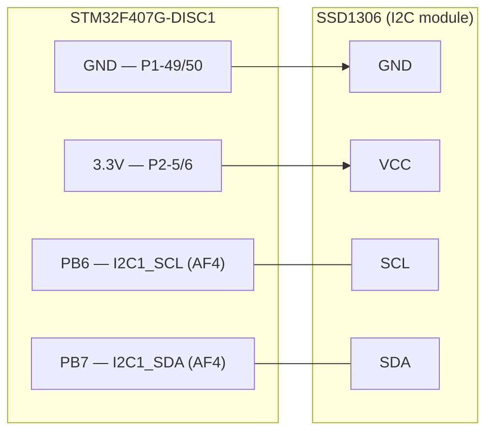

# SSD1306 Wiring

Complete wiring for the SSD1306 128×64 OLED over I2C to the STM32F407G-DISC1.

See also: [I2C Driver](../firmware/i2c-driver.md), [Register Map](../reference/register-map.md)

---

## SSD1306 module pinout (typical 4-pin I2C module)

Most common SSD1306 breakout modules expose four pins, labeled left to right:

```
  ┌─────────────────────────────────┐
  │         SSD1306 OLED            │
  │         128 × 64 px             │
  └──┬────┬────┬────┬───────────────┘
     │    │    │    │
    GND  VCC  SCL  SDA
```

!!! note "I2C address"
    Default address is **0x3C** (SA0 pin tied low, which most cheap modules do by default).
    If your module has SA0 high (or a solder bridge), the address is **0x3D** — update
    `SSD1306_ADDR` in `src/ssd1306.c`.

---

## STM32 side (DISC1 / STM32F407VG)

| STM32 signal | Pin | Role |
|---|---|---|
| I2C1_SCL | PB6 | clock |
| I2C1_SDA | PB7 | data |
| 3.3 V rail | P2-5 / P2-6 | power (3.3 V modules) |
| GND | P1-49 / P1-50 | ground |

!!! note "Header pin numbers"
    PB6 and PB7 header positions: check **UM1472 Table 11** (DISC1 user manual) for the
    exact P1/P2 row numbers. Use a multimeter in continuity mode to confirm before wiring.

Both PB6 and PB7 are configured as **open-drain with internal pull-ups** by the driver.
For anything beyond a short bench wire, replace the internal pull-ups with **4.7 kΩ**
resistors to 3.3 V.

---

## Connection table

| SSD1306 pin | Signal | Connects to | Notes |
|---|---|---|---|
| GND | Ground | GND (P1-49/50) | |
| VCC | Power | 3.3 V (P2-5/6) | most modules accept 3.3–5 V; check your module |
| SCL | I2C clock | **PB6** | open-drain + pull-up |
| SDA | I2C data | **PB7** | open-drain + pull-up |

---

## Wiring diagram



The dashed connections on SCL and SDA represent open-drain lines; both sides can only pull low.

---

## Bench bring-up notes

1. Wire the four connections above.
2. Build and flash — `main.c` calls `ssd1306_init()` then `ssd1306_fill(0xFF)` on power-up.
3. The display should show a solid **white screen** within ~100 ms of reset.
4. If there is no display activity, probe PB6 and PB7 with a logic analyzer or scope:
   - Both lines should idle **high** (pull-ups working).
   - You should see START + `0x78` address byte on every `i2c1_write()` call.
   - If SDA stays low after the address byte, the module is not ACK-ing — check VCC/GND and address.
5. `ssd1306_fill(0x00)` clears to black; `0xAA` or `0x55` gives a checkerboard pattern for pixel-level verification.
