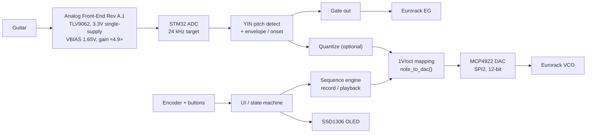
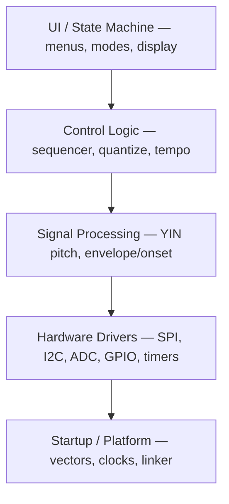
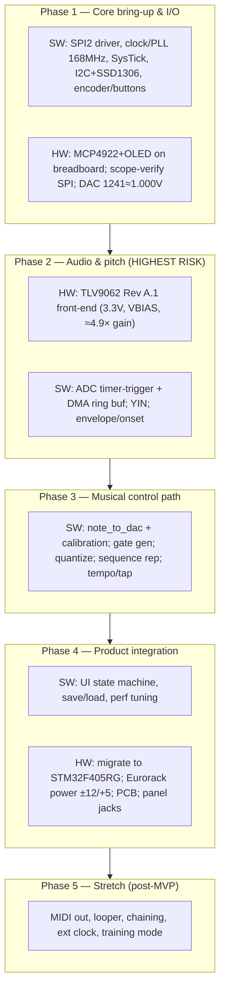

# Project Roadmap & Onboarding

An engineering overview of the project as currently defined, the current implementation
status, and the phased plan to reach a working prototype. For source-of-truth detail see
the [Charter](system/charter.md), [Requirements](system/requirements.md), and the
[Architecture](firmware/architecture.md) pages.

---

## 1. Project understanding

**guitar-cv** is a bare-metal embedded instrument that turns a **monophonic guitar signal
into real-time Eurorack CV + gate**, with an onboard **step sequencer** (record/playback,
quantized & unquantized) and a small **OLED + encoder/button UI**. Academic capstone;
the engineering ethos is explicit: **register-level bare-metal C, no HAL/CubeMX**,
"understanding over speed."

**Locked-in decisions:**

- **MCU:** STM32F407VGT6 (DISC1 dev board) → **STM32F405RG** for the final PCB.
- **DAC:** MCP4922, 3.3 V ref, 1× gain, LDAC tied low. See [MCP4922 Wiring](hardware/wiring-mcp4922.md).
- **SPI:** SPI2 — PB13 SCK / PB15 MOSI (AF5), PB12 software-GPIO CS, 16-bit, CPOL=0/CPHA=0,
  ÷8 (~2 MHz) bring-up. See [ADR-001](decisions/adr-001-spi-peripheral.md),
  [ADR-002](decisions/adr-002-cs-management.md), [ADR-003](decisions/adr-003-spi-clock-rate.md).
- **CV:** 1V/oct, C4 = 0 V, ≈103.6 DAC counts/semitone @ 3.3 Vref. See [CV Math](concepts/cv-math.md).
- **Display:** SSD1306 128×64 over I2C.
- **Analog (Rev A.1):** 3.3 V single-supply **TLV9062** front end — buffered 1.65 V VBIAS,
  ≈4.9× non-inverting gain, 1 MΩ input impedance, 3.3 kΩ/10 nF ADC filter, 24 kHz target.
  Silence ≈ midscale but **calibrated in firmware**. Supersedes TL072/74 + TLE2426 —
  see [ADR-005](decisions/adr-005-analog-front-end.md) and
  [AFE Rev A.1](hardware/analog-front-end.md).

**MVP (FR-01…FR-11):** guitar input, monophonic pitch (core range: standard guitar down
to low E2 ≈ 82.4 Hz; five-string-bass low B0 ≈ 30.87 Hz is a stretch goal), onset/gate,
1V/oct CV out, gate out, quantized + unquantized sequence record/store, tap/definable
tempo, encoder+button UI, OLED feedback. **Out of scope:** polyphony, DAW-style editing,
fancy GUI, enclosure, manufacturing. **Stretch:** MIDI out, looper, chaining, ext-clock
sync, training mode. **Success = a live demo** with a real guitar driving real modular gear.

Intended firmware layering:

---

## 2. Current implementation status

Stage: **mid Phase 1.** Both output-side hardware drivers are written and bench-verified,
and the SysTick millisecond timebase is implemented. The remaining Phase 1 items are the
clock/PLL step up to 168 MHz and encoder/button inputs. On the hardware side, the analog
front end now has an approved design (Rev A.1, [ADR-005](decisions/adr-005-analog-front-end.md))
ready to build.

| Area | Status |
|---|---|
| Toolchain / Makefile (arm-none-eabi-gcc, OpenOCD flash) | ✅ Done |
| Linker (`ld/stm32f407.ld`) + startup (`startup_stm32f407.s`, FPU, .data/.bss init) | ✅ Done |
| `src/main.c` | ✅ DAC + OLED bring-up demo (LED heartbeat, CV walk, white screen) |
| SPI2 / MCP4922 driver | ✅ Coded (`src/spi2.c`, `src/dac.c`) + **hardware-verified** 2026-06-05 via Saleae Logic 2 MSO (0/1/2 V) |
| CV math (`note_to_dac()`) | ✅ Implemented + unit-tested (`src/cv.c`) |
| I2C/SSD1306 | ✅ Coded (`src/i2c1.c`, `src/ssd1306.c`) + **hardware-verified** 2026-06-12 (Saleae Logic 2, white screen) |
| SysTick timebase (`src/systick.c`) | ✅ Implemented: 1 ms tick, `millis()`, rollover-safe `time_elapsed()`; host-tested |
| Clock/PLL (168 MHz), ADC, YIN, envelope, gate, sequencer, UI | ❌ Not started |
| Encoder / button inputs | ❌ Not started |
| Analog front-end (HW) | 📐 Rev A.1 design approved ([ADR-005](decisions/adr-005-analog-front-end.md)); build not started |
| Eurorack power (HW) | ❌ Not started (constraint fixed: AFE runs on 3.3 V — see [Power](hardware/power.md)) |
| Tests / CI | ✅ Host-side unit tests (`cv.c`, `mcp4922.c`, SysTick elapsed logic) run in GitHub Actions on every push/PR |

**Next move: clock/PLL to 168 MHz with a central clock-description layer** — do it before
ADC/timer configuration so peripheral timing constants (I2C CCR/TRISE, SPI baud, the
24 kHz ADC trigger) are derived from actual bus clocks instead of hardcoded 16 MHz
assumptions. Note the STM32F4 timer-clock rule: timers run at 2× their APB clock when
the APB prescaler ≠ 1.

---

## 3. Phases to complete the prototype (HW + SW)

- **Phase 1 — Core bring-up.** SPI2 driver + `spi2_write16()`, clock/PLL, SysTick, I2C+SSD1306,
  inputs. Breadboard MCP4922+OLED, scope-verify SPI, DAC sanity (count 1241 ≈ 1.000 V).
  *Exit: deterministic CV on the DAC, text on OLED.*
- **Phase 2 — Audio & detection (riskiest).** Build the Rev A.1 TLV9062 front end
  (3.3 V single-supply, buffered VBIAS, ≈4.9× gain — [ADR-005](decisions/adr-005-analog-front-end.md));
  ADC at 24 kHz via timer trigger + DMA ring buffer; firmware silence/midpoint
  calibration; YIN; digital envelope/onset. *Key tension: latency vs. accuracy at the
  low end — low E2 (82.4 Hz, ~12 ms period) is the core requirement; low B0
  (30.87 Hz, ~32 ms period) is stretch and would roughly triple the analysis window.
  Exit: stable live note/Hz readout at playable latency.*
- **Phase 3 — Control path.** CV mapping + calibration, gate from onset/offset, quantization,
  sequence storage (quantized + unquantized), tempo/tap. *Exit: guitar → correct CV/gate
  driving a real oscillator/envelope.*
- **Phase 4 — Product integration.** UI state machine, save/load, tuning; migrate F407→F405,
  Eurorack power, PCB, panel. *Exit: standalone, demo-ready.*
- **Phase 5 — Stretch:** MIDI, looper, chaining, ext clock, training mode.

**Cross-cutting recommendations**

1. **Host-side unit tests** for pure DSP/math (YIN, `note_to_dac`, quantization, timing
   helpers) — testable off-target, de-risks Phase 2/3 cheaply. In place for the DAC path
   and SysTick elapsed logic; extend to each new pure module.
2. **CI**: host unit tests run in GitHub Actions on every push/PR. Still missing: an ARM
   cross-compile job so firmware link breakage is caught in CI too.
3. **Plan the F407→F405 pin migration early** so analog/PCB work isn't redone.
4. **Keep ADR discipline** for open decisions: ADC pin/instance/DMA mapping, pitch-window
   length, power topology (analog 3.3 V separation).
5. **Two-track development is now viable:** Track A finishes platform bring-up (PLL,
   timeouts, OLED text, encoder); Track B starts hardware-independent Phase 2 firmware
   (midpoint calibration, sample centering, block metrics, envelope/gate hysteresis,
   synthetic-signal test harness) against the fixed Rev A.1 analog contract.
